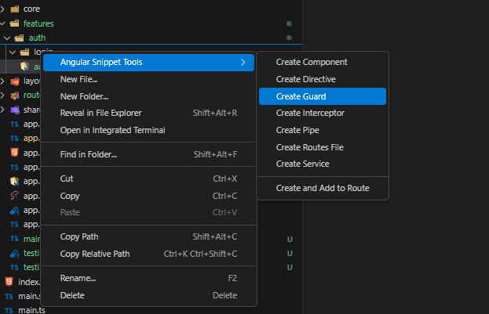
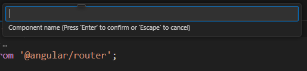
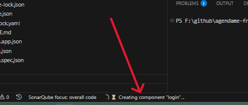

# 🧩 Angular Snippet Tools

A powerful extension for Visual Studio Code that simplifies Angular development. Generate components, services, routes, pipes, and more directly from the context menu.

---

## ✨ Features

- ✅ Right-click to generate Angular elements:

  - Component
  - Directive
  - Guard
  - Interceptor
  - Pipe
  - Service

- ✅ Additional commands:
  - **Create and Add to Route**: Adds a new component to the closest `*.routes.ts` file
  - **Create Routes File**: Generates a default Angular routes file

---

## 🎯 How It Works

Using Angular Snippet Tools is as easy as 1-2-3:

### 🥇 Step 1: Right-click on a folder and select what you want to generate

> 📂 The item will be created directly **inside the folder you clicked**.



---

### 🥈 Step 2: Enter a name for your component, service, or other element



---

### 🥉 Step 3: Watch the VS Code loading bar as your Angular element is generated



---

Once generated, your file will be placed **exactly in the selected folder**, using Angular 17+ conventions like `standalone` components and proper structure.

---

## 🌍 Localization Support

Supports English (default) and Spanish. Powered by [`@vscode/l10n`](https://www.npmjs.com/package/@vscode/l10n).

---

## 📦 Requirements

- Angular CLI installed globally:
  ```bash
  npm install -g @angular/cli
  ```
